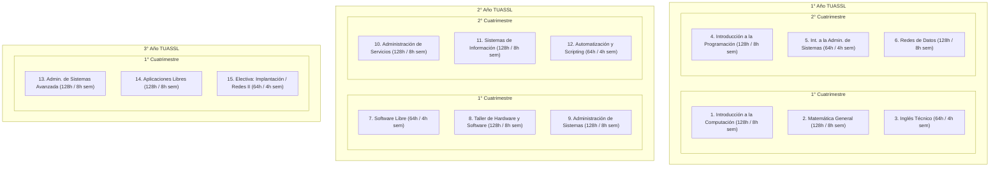
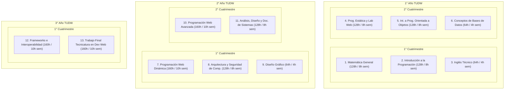
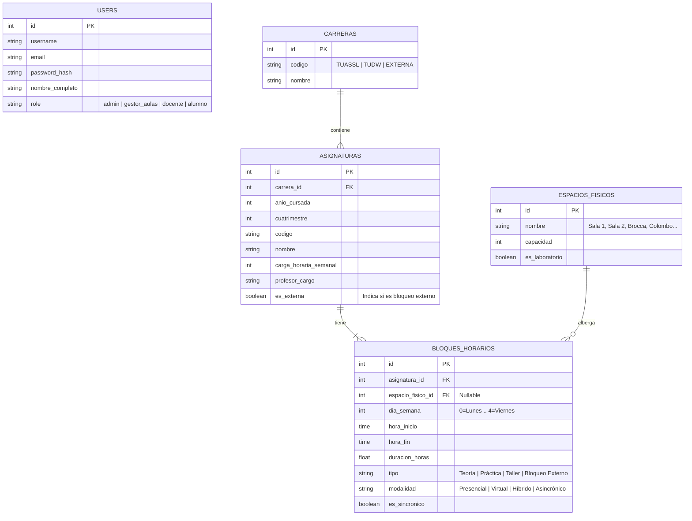
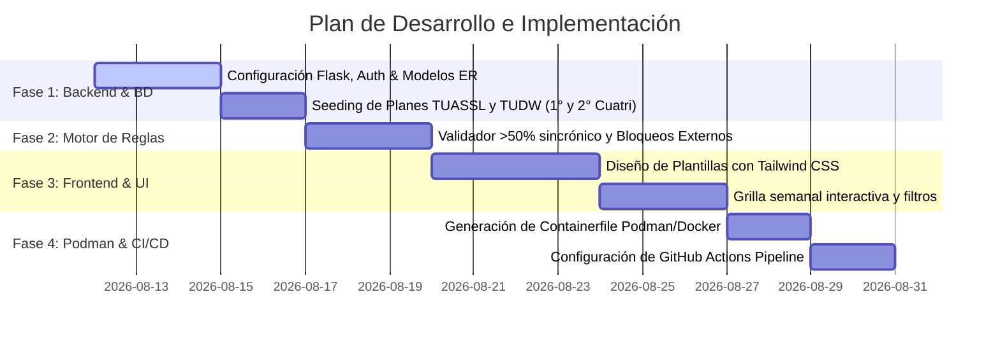

# Plan Estratégico de Desarrollo: Sistema Web de Gestión de Horarios y Aulas
**Departamento de Ciencia y Tecnología — CURZA - Universidad Nacional del Comahue (UNComa)**  
*Tecnicatura Universitaria en Administración de Sistemas y Software Libre (TUASSL) & Tecnicatura Universitaria en Desarrollo Web (TUDW)*

---

## 1. Resumen Ejecutivo del Proyecto

El proyecto contempla el desarrollo de un **sistema web centralizado y alojable en servidor** para gestionar la reserva de aulas físicas y la planificación horaria de las tecnicaturas de pregrado del Departamento en la sede **CURZA**.

El sistema contempla:
1. **Mapeo completo de los planes de estudio** para **ambos cuatrimestres** (1° y 2° cuatrimestre) de la **Tecnicatura Universitaria en Administración de Sistemas y Software Libre (TUASSL)** (Ord. 0895/12) y la **Tecnicatura Universitaria en Desarrollo Web (TUDW)** (Ord. 0885/12).
2. **Modelado diferenciado por modalidades y actividades** (teoría, práctica, taller) pudiendo ser presencial en aula/laboratorio, virtual sincrónico o asincrónico en plataforma PEDCO.
3. **Validación automática de la norma del >50% de horas sincrónicas** (4hs semanales $\to$ $\ge$3hs sincrónicas; 8hs semanales $\to$ $\ge$5hs sincrónicas; 10hs semanales $\to$ $\ge$6hs sincrónicas).
4. **Control de solapamiento de aulas físicas, docentes y cohortes** en tiempo real.
5. **Bloqueo y reserva de aulas por materias/eventos externos a las tecnicaturas** (ej: materias de Exactas, seminarios o actividades institucionales que ocupan laboratorio/aula física).
6. **Sistema de control de usuarios con roles y permisos** (Administrador, Gestor de Aulas, Docente Cátedra, Estudiante).
7. **Despliegue mediante contenedor compatible con Podman/Docker** y pipeline de **CI/CD con GitHub Actions**.

---

## 2. Requisitos y Reglas de Negocio Institucionales

### A. Regla del >50% de Carga Horaria Sincrónica
La normativa dispone que el dictado en tiempo real (**Sincrónico**) debe superar estrictamente el 50% de las horas semanales totales asignadas al plan de estudios de cada asignatura.

$$\text{Horas Sincrónicas Mínimas} = \left\lfloor \frac{\text{Carga Total}}{2} \right\rfloor + 1$$

#### Tabla de Aplicación Segregada:
| Carga Horaria Semanal | Mínimo Horas Sincrónicas (>50%) | Máximo Horas Asincrónicas (PEDCO) | Ejemplo de Modalidad |
| :--- | :---: | :---: | :--- |
| **4 Horas Semanales** | **3 Horas** | **1 Hora** | 2h Presencial/Híbrido + 1h Virtual Sinc. + 1h PEDCO |
| **8 Horas Semanales** | **5 Horas** | **3 Horas** | 3h Presencial + 2h Virtual Sinc. + 3h PEDCO |
| **10 Horas Semanales** | **6 Horas** | **4 Horas** | 3h Híbrido + 3h Virtual Sinc. + 4h PEDCO |

> [!IMPORTANT]
> El sistema no permitirá la publicación de un horario de materia perteneciente a las tecnicaturas si el total de horas sincrónicas es inferior al mínimo exigido por la norma.

---

### B. Segregación de Modalidades y Bloqueos de Aula
- 🏫 **Presencial (Reserva Obligatoria de Aula/Laboratorio)**: Clases en *Sala 1 Informática*, *Sala 2 Informática*, *Sala Brocca*, *Sala Colombo*, *Aula 18*, *Aula 21*, etc.
- 💻 **Virtual Sincrónico**: Clases en vivo por videollamada. Cuenta como hora sincrónica pero **no consume ni bloquea aula física**.
- 🔀 **Híbrido / Presencial Remoto**: Clase física con transmisión en vivo. **Requiere reserva de aula física**.
- 📚 **Asincrónico (PEDCO)**: Actividades en plataforma virtual. **No consume aula ni franja sincrónica**.
- 🚫 **Bloqueo Externo**: Asignación de aula para materias externas a las tecnicaturas (ej: Estadística Aplicada, Matemática 1, capacitaciones). Bloquea la disponibilidad física del espacio sin aplicar las reglas de sincronía de las tecnicaturas.

---

### C. Sistema de Usuarios y Roles (RBAC)
- 👑 **Administrador**: Gestión global de usuarios, carreras, asignaturas, aulas y configuración de producción.
- 🏫 **Gestor de Aulas (CURZA / Dpto. Ciencia y Tecnología)**: Carga de horarios, asignación de aulas físicas, gestión de bloqueos externos y resolución de colisiones.
- 👨‍🏫 **Docente de Cátedra**: Consulta de grillas y solicitud de aulas o cambios de modalidad.
- 🎓 **Estudiante / Público**: Consulta interactiva de grillas semanales por cohorte, carrera, año o aula.

---

## 3. Planes de Estudio Relevados de los PDFs Oficiales

A partir de los archivos de ordenanzas oficiales (`Ordenanza 0895/12` para TUASSL y `Ordenanza 0885/12` para TUDW), se releva la estructura completa de asignaturas por cuatrimestre:

### A. Tecnicatura Universitaria en Administración de Sistemas y Software Libre (TUASSL)
*Ordenanza N° 0895/12 — Duración: 2,5 Años (5 Cuatrimestres) — Total: 1.600 Hs Reloj*



#### Detalle de Horas y Sincronía Mínima - TUASSL:
| Cuatrimestre | Asignatura | Carga Horaria Semanal | Mínimo Sincrónico Requerido (>50%) | Máximo PEDCO |
| :--- | :--- | :---: | :---: | :---: |
| **1° Año - 1° Cuatri** | Introducción a la Computación | 8 hs | **5 hs** | 3 hs |
| **1° Año - 1° Cuatri** | Matemática General | 8 hs | **5 hs** | 3 hs |
| **1° Año - 1° Cuatri** | Inglés Técnico | 4 hs | **3 hs** | 1 hs |
| **1° Año - 2° Cuatri** | Introducción a la Programación | 8 hs | **5 hs** | 3 hs |
| **1° Año - 2° Cuatri** | Int. a la Administración de Sistemas | 4 hs | **3 hs** | 1 hs |
| **1° Año - 2° Cuatri** | Redes de Datos | 8 hs | **5 hs** | 3 hs |
| **2° Año - 1° Cuatri** | Software Libre | 4 hs | **3 hs** | 1 hs |
| **2° Año - 1° Cuatri** | Taller de Hardware y Software | 8 hs | **5 hs** | 3 hs |
| **2° Año - 1° Cuatri** | Administración de Sistemas | 8 hs | **5 hs** | 3 hs |
| **2° Año - 2° Cuatri** | Administración de Servicios | 8 hs | **5 hs** | 3 hs |
| **2° Año - 2° Cuatri** | Sistemas de Información | 8 hs | **5 hs** | 3 hs |
| **2° Año - 2° Cuatri** | Automatización y Scripting | 4 hs | **3 hs** | 1 hs |
| **3° Año - 1° Cuatri** | Administración de Sistemas Avanzada | 8 hs | **5 hs** | 3 hs |
| **3° Año - 1° Cuatri** | Aplicaciones Libres | 8 hs | **5 hs** | 3 hs |
| **3° Año - 1° Cuatri** | Electiva (Implantación / Redes II) | 4 hs | **3 hs** | 1 hs |

---

### B. Tecnicatura Universitaria en Desarrollo Web (TUDW)
*Ordenanza N° 0885/12 — Duración: 2,5 Años (5 Cuatrimestres) — Total: 1.600 Hs Reloj*



#### Detalle de Horas y Sincronía Mínima - TUDW:
| Cuatrimestre | Asignatura | Carga Horaria Semanal | Mínimo Sincrónico Requerido (>50%) | Máximo PEDCO |
| :--- | :--- | :---: | :---: | :---: |
| **1° Año - 1° Cuatri** | Matemática General | 8 hs | **5 hs** | 3 hs |
| **1° Año - 1° Cuatri** | Introducción a la Programación | 8 hs | **5 hs** | 3 hs |
| **1° Año - 1° Cuatri** | Inglés Técnico | 4 hs | **3 hs** | 1 hs |
| **1° Año - 2° Cuatri** | Programación Estática y Lab Web | 8 hs | **5 hs** | 3 hs |
| **1° Año - 2° Cuatri** | Int. a Prog. Orientada a Objetos | 8 hs | **5 hs** | 3 hs |
| **1° Año - 2° Cuatri** | Conceptos de Bases de Datos | 4 hs | **3 hs** | 1 hs |
| **2° Año - 1° Cuatri** | Programación Web Dinámica | 10 hs | **6 hs** | 4 hs |
| **2° Año - 1° Cuatri** | Arquitectura y Seguridad de Computadoras | 8 hs | **5 hs** | 3 hs |
| **2° Año - 1° Cuatri** | Diseño Gráfico | 4 hs | **3 hs** | 1 hs |
| **2° Año - 2° Cuatri** | Programación Web Avanzada | 10 hs | **6 hs** | 4 hs |
| **2° Año - 2° Cuatri** | Análisis, Diseño y Doc. de Sistemas | 8 hs | **5 hs** | 3 hs |
| **3° Año - 1° Cuatri** | Frameworks e Interoperabilidad | 10 hs | **6 hs** | 4 hs |
| **3° Año - 1° Cuatri** | Trabajo Final Tecnicatura | 10 hs | **6 hs** | 4 hs |

---

## 4. Arquitectura de Software y Modelo de Datos Ampliado

- **Backend**: **Flask (Python 3.10+)** + **Flask-SQLAlchemy** (ORM) + **Flask-Login**.
- **Frontend**: **Tailwind CSS** + **Jinja2 Templates** + JavaScript vanilla para respuesta interactiva.
- **Base de Datos**: **SQLite** (desarrollo/local) / **PostgreSQL** (producción en servidor).
- **Despliegue**: **Podman / Docker Container** + **Gunicorn** + **Nginx**.

### Diagrama Entidad-Relación (ER) con Gestión de Bloqueos Externos:



---

## 5. Módulos de la Aplicación Web

1. **Dashboard Principal**: Indicadores de horas sincrónicas, porcentaje de cumplimiento de la regla >50%, total de materias por cuatrimestre y estado de ocupación de salas.
2. **Grilla Semanal Interactiva de Horarios**: Visualización por día (Lunes a Viernes) y por hora con filtros dinámicos por Carrera, Cuatrimestre, Aula/Sala y Modalidad.
3. **Gestor de Asignaturas y Cargas Horarias**: Formulario con validador dinámico que exige el mínimo de horas sincrónicas requeridas según el plan de estudio.
4. **Gestor de Reservas y Bloqueo de Aulas Externas**: Permite registrar bloqueos de salas por materias de otras carreras o eventos institucionales impidiendo el solapamiento físico.
5. **Panel de Administración de Usuarios (RBAC)**: Gestión de credenciales y roles.

---

## 6. Fases del Plan de Implementación



---

## 7. Configuración del Contenedor Podman / Docker

### Archivo `Containerfile` (compatible con Podman y Docker):

```dockerfile
# Stage 1: Build & Environment
FROM python:3.11-slim AS builder

WORKDIR /app
ENV PYTHONDONTWRITEBYTECODE=1 \
    PYTHONUNBUFFERED=1

RUN apt-get update && apt-get install -y --no-install-recommends \
    build-essential \
    && rm -rf /var/lib/apt/lists/*

COPY requirements.txt .
RUN pip install --no-cache-dir --user -r requirements.txt

# Stage 2: Final Runtime Image
FROM python:3.11-slim WORKDIR /app

ENV PATH=/root/.local/bin:$PATH \
    FLASK_APP=run.py \
    PORT=5000

COPY --from=builder /root/.local /root/.local
COPY . .

EXPOSE 5000

CMD ["gunicorn", "--workers", "4", "--bind", "0.0.0.0:5000", "run:app"]
```

#### Comandos de Ejecución con Podman:
```bash
# Construir imagen con Podman
podman build -t sistema-horarios-curza:latest -f Containerfile .

# Ejecutar contenedor
podman run -d -p 5000:5000 --name horarios_app -v horarios_data:/app/instance sistema-horarios-curza:latest
```

---

## 8. Integración Continua y Despliegue Automatizado (CI/CD con GitHub Actions)

### Archivo `.github/workflows/ci-cd.yml`:

```yaml
name: CI/CD Pipeline - Sistema Horarios CURZA

on:
  push:
    branches: [ "main", "master" ]
  pull_request:
    branches: [ "main", "master" ]

jobs:
  test:
    name: Pruebas Automatizadas & Linting
    runs-on: ubuntu-latest
    steps:
      - name: Checkout del Código
        uses: actions/checkout@v3

      - name: Configurar Python 3.11
        uses: actions/setup-python@v4
        with:
          python-version: "3.11"

      - name: Instalar Dependencias
        run: |
          python -m pip install --upgrade pip
          pip install -r requirements.txt
          pip install pytest flake8

      - name: Linting de Código
        run: |
          flake8 app --count --select=E9,F63,F7,F82 --show-source --statistics

      - name: Ejecutar Test de Reglas (>50% sincrónico y solapamientos)
        run: |
          pytest tests/ -v

  build-container:
    name: Construcción de Contenedor & Push a Registry
    needs: test
    runs-on: ubuntu-latest
    if: github.ref == 'refs/heads/main'
    steps:
      - name: Checkout del Código
        uses: actions/checkout@v3

      - name: Configurar Podman / Buildah
        uses: redhat-actions/buildah-build@v2
        id: build-image
        with:
          image: sistema-horarios-curza
          tags: latest ${{ github.sha }}
          containerfiles: |
            ./Containerfile

      - name: Push a GitHub Container Registry (GHCR)
        uses: redhat-actions/push-to-registry@v2
        with:
          image: ${{ steps.build-image.outputs.image }}
          tags: ${{ steps.build-image.outputs.tags }}
          registry: ghcr.io/${{ github.repository_owner }}
          username: ${{ github.actor }}
          password: ${{ secrets.GITHUB_TOKEN }}
